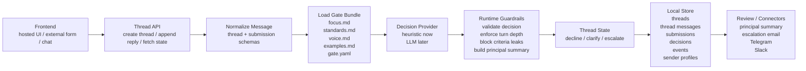

# OpenGates

Source-available runtime for filtering inbound through conversation.

You define what you care about in a few Markdown files. OpenGates handles the conversation — decline, clarify, or escalate — so only the best signal reaches you.

Outbound is getting cheaper every month. Millions of agents will soon be writing to you. You will miss the signal from the noise. This is the other side of that trade.

OpenGates powers [Ante](https://ante.so), the hosted product.

Licensed under Elastic License 2.0. You can use it internally, including in commercial settings, but you cannot offer OpenGates itself as a hosted or managed service.

Requires Python 3.10+.

## What This Includes
- a thread engine that processes each turn into `decline`, `clarify`, or `escalate`
- a Markdown-first gate bundle format
- a minimal FastAPI reference UI
- local storage for threads, messages, decisions, and sender profiles
- a bundled starter gate based on `demo-investor`
- API routes for external form/chat frontends

## Architecture


## How It Works
1. A sender starts a thread through the built-in web UI or an external client.
2. The runtime converts the inbound turn into stable thread and submission schemas.
3. OpenGates loads the gate bundle for that thread's gate.
4. The provider decides `decline`, `clarify`, or `escalate` for the current turn.
5. The runtime applies guardrails, enforces remaining clarification rounds, and builds a principal-facing summary for escalations.
6. If a principal email and SMTP settings are configured, OpenGates sends the escalation email.
7. The thread state, messages, decision, event log, and sender profile are persisted locally.
8. The built-in UI or an external client can fetch the updated thread and render the next step.

## Quick Start

Installable package:
```bash
pip install opengates
opengates serve --host 127.0.0.1 --port 8000
```

Source checkout:
```bash
uv sync
uv run opengates serve --host 127.0.0.1 --port 8000
```

Open [http://127.0.0.1:8000](http://127.0.0.1:8000).

Fastest test route:
- [http://127.0.0.1:8000/demo](http://127.0.0.1:8000/demo)

## Gate Bundle
Each gate lives in `gates/<gate_id>/` with:
- `focus.md` — what you care about
- `standards.md` — what quality bar must be met
- `voice.md` — how replies should sound
- `examples.md` — examples that sharpen the gate's judgment
- optional `gate.yaml` — thread depth, naming, route behavior

Useful `gate.yaml` fields:
- `title`: public page title such as `Investor Gate`
- `assistant_name`: label shown on assistant replies
- `surface_label`: public noun for copy like `gate`
- `public_path`: public route for the gate page
- `assistant_avatar`, `assistant_status`, `welcome_headline`, `welcome_body`: optional intake-page presentation
- `composer_placeholder`, `invited_topics`: optional intake-page guidance
- `principal_email`: recipient for escalation emails
- `max_clarification_rounds`: bounded depth for follow-up turns

If you run from a clean working directory, OpenGates falls back to the bundled `demo-investor` starter gate. If a local `./gates` directory exists, it takes precedence. You can also point to a custom gate directory with `OPENGATES_GATES_DIR`.

## Provider Strategy
- `HeuristicDecisionProvider`: catches obvious spam, applies explicit reject rules, works without any API key
- future LLM provider: handles ambiguous judgment, better tone, stronger few-shot use, richer summaries
- runtime guardrails stay outside both, so behavior remains auditable and stable

## OpenAI Provider
To use a real model:

If you are working from source:

```bash
cp .env.example .env
```

Otherwise create a `.env` file in your working directory with:

Set:
```bash
OPENGATES_PROVIDER=openai
OPENAI_API_KEY=your_key_here
OPENGATES_OPENAI_MODEL=gpt-5-mini
OPENGATES_DEBUG_PROMPTS=1
```

Notes:
- `heuristic` mode works without any key
- `openai` mode uses the OpenAI Responses API with structured output parsing
- obvious spam still gets short-circuited by heuristics before the model call
- if the OpenAI call fails, the runtime falls back to the heuristic provider
- `.env` and `.env.local` are read from your current working directory, or from `OPENGATES_CONFIG_DIR` if you set it

## Escalation Email
OpenGates can send the first escalation email when both of these are true:
- `principal_email` is set in the gate's `gate.yaml`
- SMTP env vars are configured

Supported env vars:
```bash
OPENGATES_SMTP_HOST=smtp.example.com
OPENGATES_SMTP_PORT=587
OPENGATES_SMTP_USERNAME=...
OPENGATES_SMTP_PASSWORD=...
OPENGATES_SMTP_USE_TLS=1
OPENGATES_SMTP_USE_SSL=0
OPENGATES_NOTIFICATION_FROM_EMAIL=gatekeeper@example.com
OPENGATES_NOTIFICATION_FROM_NAME=OpenGates
```

## Repo Shape
```text
gates/
  demo-investor/
src/opengates/
  app.py
  runtime.py
  gates.py
  storage.py
  schemas.py
  providers/
  starter_gates/
  templates/
tests/
```

## Commands
```bash
opengates list-gates
opengates init-gate --from demo-investor --to my-gate
opengates serve
```

## Tests
```bash
uv run pytest
```

## License

OpenGates is source-available under Elastic License 2.0. That means:
- internal use is allowed, including inside commercial companies
- modification is allowed
- redistribution is allowed subject to the license terms
- offering OpenGates itself as a hosted or managed service is not allowed
